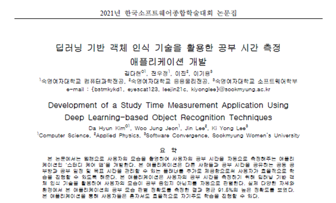
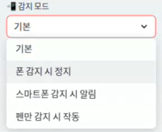
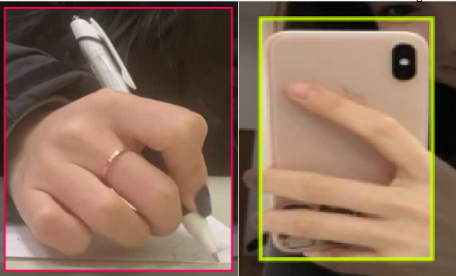
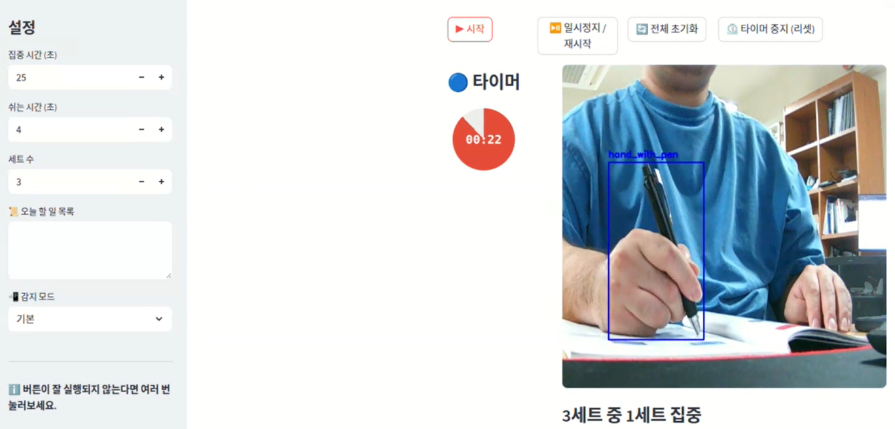
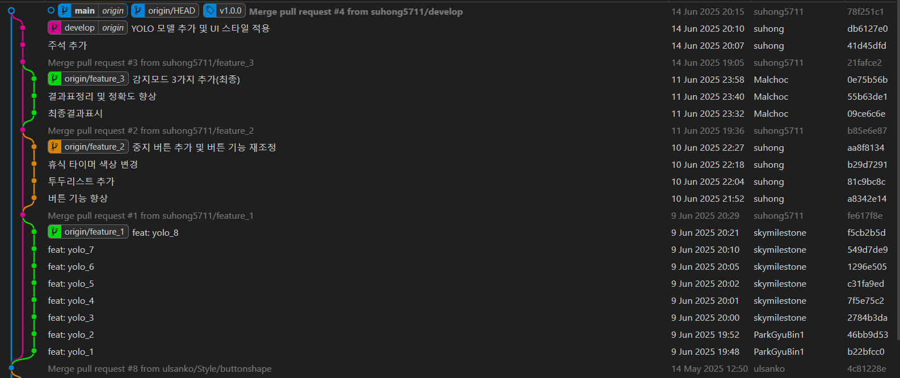
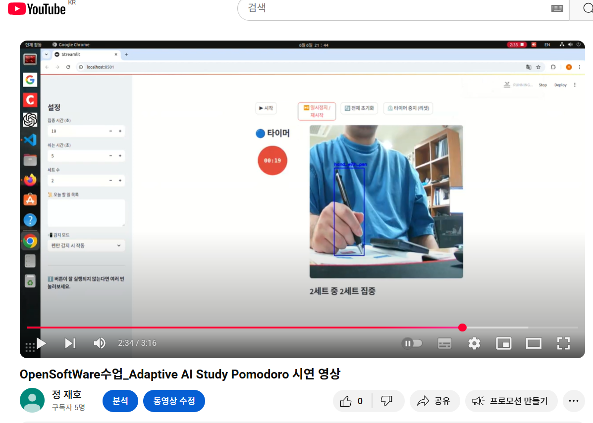
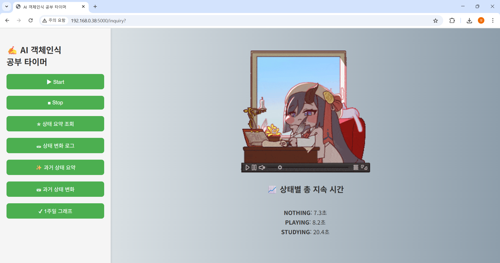
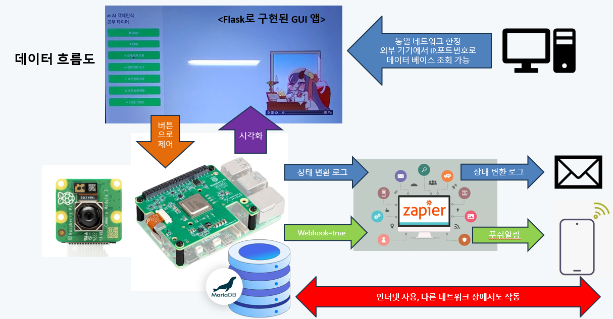

# 📚 Adaptive AI Study Pomodoro

> **Open Source Software Term Project**  
> **팀 이름**: AI 객체인식 뽀모도로  
> **팀원**: 정재호, 심용준, 박규빈, 전수홍

---

# 🧩 1. Background and Motivation

## 🧪 1.1 문제 제기

### 📌 스마트폰이 집중을 방해하는 이유


- 스마트폰은 현대 사회에서 필수적인 도구이지만, 학습 중에는 큰 방해 요소가 됩니다.
- 연구 결과에 따르면 스마트폰이 옆에 있기만 해도 집중력이 분산되고, 학업 성과가 감소한다고 합니다.

📚 **관련 연구 References:**
- 🔗 [교육부 블로그](https://if-blog.tistory.com/6951): 스마트폰은 공부의 적
- 🔗 [Rutgers University 연구](https://www.rutgers.edu/news/cellphone-distraction-classroom-can-lead-lower-grades-rutgers-study-finds): 수업 중 스마트폰 사용 그룹은 성적이 평균 5% 낮음
- 🔗 [University of Texas at Austin 연구](https://news.utexas.edu/2017/06/26/the-mere-presence-of-your-smartphone-reduces-brain-power/): 스마트폰이 가까이 있을수록 주의력과 인지 능력 저하

---

## 🧪 1.2 기존 해결책 및 한계

### 🕒 일반 뽀모도로 앱의 한계

🔗 [Pomofocus](https://pomofocus.io/)  


- 단순 타이머 기능만 제공
- 실제로 집중하고 있는지는 알 수 없음
- 설문 조사 결과, 70%의 사용자가 타이머 중 스마트폰 사용 경험 있음

### 🎓 관련 연구 및 문제점

🔗 [딥러닝 기반 공부 측정 앱 (숙명여대)](https://www.dbpia.co.kr/pdf/pdfView.do?nodeId=NODE11036054)



- YOLOv5와 무거운 알고리즘 사용으로 실시간성 부족
- 결과만 보여주는 사후처리 방식
- 뽀모도로 기능 없음 → 뽀모도로의 장점(집중력 향상, 번아웃 방지 등)을 살릴 수 없음

---

### ✅ **결론**

단순한 공부 타이머를 넘어서,  
**사용자의 행동(펜/스마트폰 사용)을 인식해 타이머를 자동 제어하는**  
**“적응형 AI 뽀모도로”가 필요하다고 판단했습니다.**

---

# 💡 2. 제안 아이디어: Adaptive AI Study Pomodoro

## 🔄 2.1 Adaptiveness 기능

- 사용자의 행동(펜 또는 스마트폰 사용)에 따라 타이머가 자동으로 동작을 변경합니다.
- 사용자는 4가지 모드 중 하나를 선택할 수 있으며, 각 모드에 따라 타이머의 반응이 달라집니다.



| 모드 | 설명 | 필요한 이유 |
|------|------|-------------|
| **기본** | 타이머만 작동, 객체 인식 없음 | 단순 뽀모도로처럼 사용하려는 유저를 위한 기본 모드 |
| **폰 감지 시 정지** | 스마트폰을 감지하면 타이머가 멈춤 | 스마트폰 사용 중에는 공부한 것으로 간주하지 않기 위함 |
| **폰 감지 시 알림** | "스마트폰을 내려놓으세요" 음성 안내 제공 | 흐름은 유지하되, 사용자에게 경각심을 주어 주의 집중 유도 |
| **펜 감지 시만 작동** | 펜이 감지될 때만 타이머 동작 | 실제로 공부할 때만 집중 시간으로 간주하기 위함 |

---

## 🧠 2.2 AI 기능

- **모델**: YOLOv8n.pt / YOLOv11n.pt (경량화된 custom 모델)
- **클래스**: `hand_with_pen`, `smartphone`
- **판별 방식**: 프레임 단위 객체 인식 → 펜이면 `Studying`, 스마트폰이면 `Playing`



---

## ⏰ 2.3 Study Pomodoro 기능

- 집중 시간 / 휴식 시간 / 세트 수 조절
- 집중 ↔ 휴식 사이클 자동 전환
- 타이머 제어 버튼 제공



| 버튼 이름 | 설명 | 필요한 이유 |
|-----------|------|--------------|
| **집중 시간 ±** | 초 단위로 집중 시간 조절 | 개인별 집중력 차이를 반영 |
| **쉬는 시간 ±** | 초 단위로 휴식 시간 조절 | 회복 시간을 유연하게 조절 |
| **세트 수 ±** | Pomodoro 반복 횟수 조절 | 목표 학습량에 맞게 설정 가능 |
| **시작** | 타이머 시작 | 사용자가 설정한 값으로 실행 |
| **일시정지 / 재시작** | 중간 저장 후 재개 | 잠깐의 중단 시에도 연속성 유지 |
| **전체 초기화** | 타이머 + 세트 모두 초기화 | 실수나 계획 변경 시 유용 |
| **타이머 중지(리셋)** | 시간만 초기화, 세트는 유지 | 짧은 재정비 후 집중 재개 |

---

# 🛠️ 3. Development Process

## 👥 3.1 팀 역할

| 이름 | 역할 |
|------|------|
| 정재호 | AI 학습 (main), GUI 코딩 (sub), 발표 자료 및 README 작성 (sub) |
| 심용준 | GUI 코딩 (main), Git 관리 (sub) |
| 박규빈 | 발표 자료 및 README 작성 (main), GUI 코딩 (sub) |
| 전수홍 | Git 관리 (main), GUI 코딩 (sub) |

## 🔨 3.2 개발 과정

1. **데이터셋 수집 및 선별**  
   🔗 [Roboflow](https://roboflow.com/)

2. **모델 학습**  
   🔗 [YOLOv8n/YOLO11n 학습 코드](https://drive.google.com/file/d/15wBoro0p-5USvS3AJ6KezLd-S71Mwa1q/view?usp=drive_link)

3. **기반 뽀모도로 앱 구조 분석**  
   🔗 [oss_pomodoro GitHub](https://github.com/ulsanko/oss_pomodoro.git)

4. **기능 정의 및 설계**

5. **Streamlit 기반 개발 시작**

## 🛠️ 3.3 Git을 활용한 협업  
 
1. develop branch를 만들고, 각자 feature branch를 생성  
2. VScode에서 개발을 진행한 후에, Github에서 Pull Request를 하여 의견을 받음
3. 팀원들의 확인을 받고 Merge를 진행
4. develop에서 개발 후, merge하는 방식으로 진행 (기능을 각자 맡아서 만들기 위해)
5. Git tag 추가
6. 시작 : ParkGyuBin1(박규빈) ⭢ skymilestone(정재호) ⭢ suhong5711(전수홍) ⭢ Malchoc(심용준)

---

# 🎬 4. 시연 영상

[🔗 YouTube 시연 영상 보기](https://youtu.be/YLhkBrOgWs8)  


---

# 🔮 5. Future Work

## ✅ 성능 최적화 및 모델 경량화

- 현재 YOLOv8n 및 YOLO11n 사용 → 개발 초반에는 지연이 없었지만, 기능 추가로 인한 전체 코드량(연산량)이 많아 일부 환경에서 딜레이 발생
- 향후 MobileNet, ResNet 등의 경량 모델로 전환 예정
- Streamlit 코드 구조 최적화도 고려 중  

## ✅ 다른 IOT프로젝트와 연계

- 다른 IOT 프로젝트 : 라즈베리파이에서 동작 가능한, 객체인식 기술을 활용한 공부시간 측정 및 알림 서비스
- Playing 5초 이상 지속 시 푸시 알림 전송, 실행 후 결과 이메일 전송, 데이터 베이스를 활용하여 과거 이력 조회 기능
- 향후 OSS 프로젝트와 IOT 프로젝트를 합쳐서 더 발전된 모습의 app 제작  
[🔗 YouTube IOT 프로젝트 시연 영상 보기](https://youtu.be/3JRhURu_qpI)  

 
---

# ⚙️ 6. 실행 방법

> ❗ Nvidia-GPU 사용 권장 ([🔗 Nvidia GPU 드라이버 업데이트 사이트](https://www.nvidia.com/en-us/drivers/))  
> ❗ 웹캠 필수 ([🔗 웹캠 테스트 사이트](https://webcamtests.com/))

## 🪟 Windows  
conda 가상환경 설치(인공지능 사용을 위한 가상환경)  
[🔗 conda 설치 사이트](https://www.anaconda.com/)  

```bash
# Conda 환경 구성
conda create -n opensw python=3.9 -y
conda activate opensw
python -m pip install --upgrade pip  
```  

git 설치(git clone을 하기 위해 설치)  
[🔗 git 설치 사이트](https://git-scm.com/downloads)  
```bash
# Git 설치 후 프로젝트 클론
git clone https://github.com/suhong5711/oss_pomodoro.git
```  
Pytorch 설치(빠른 추론을 위한 GPU사용)  
[🔗 pytorch 설치 사이트](https://pytorch.kr/get-started/locally/) 
```bash
#터미널에서 CUDA 버젼 확인
nvidia-smi

# (예시) Window CUDA 12.6 기준 PyTorch 설치 명령어, opensw 가상환경 안에서 설치할 것
pip3 install torch torchvision torchaudio --index-url https://download.pytorch.org/whl/cu126
```  

실행  
```bash
# opensw 가상환경 안에서 설치할 것
pip install -r requirements.txt

cd oss_pomodoro

# app.py에서 모델 경로 수정 후 실행
streamlit run app.py
```

## 🐧 Linux
venv 가상환경 & Git설치  

```bash
# venv 환경 구성
sudo apt install python3-venv
python3 -m venv opensw
source opensw/bin/activate

# Git 설치 후 프로젝트 클론
sudo apt update
sudo apt install git
git clone https://github.com/suhong5711/oss_pomodoro.git
```

Pytorch 설치(빠른 추론을 위한 GPU사용)  
[🔗 pytorch 설치 사이트](https://pytorch.kr/get-started/locally/) 
```bash
#터미널에서 CUDA 버젼 확인
nvidia-smi

# (예시) Linux CUDA 12.6 기준 PyTorch 설치 명령어, opensw 가상환경 안에서 설치할 것
pip3 install torch torchvision torchaudio
```

실행
```bash
cd oss_pomodoro
pip install -r requirements.txt

# app.py에서 모델 경로 수정 후 실행
streamlit run app.py
```
